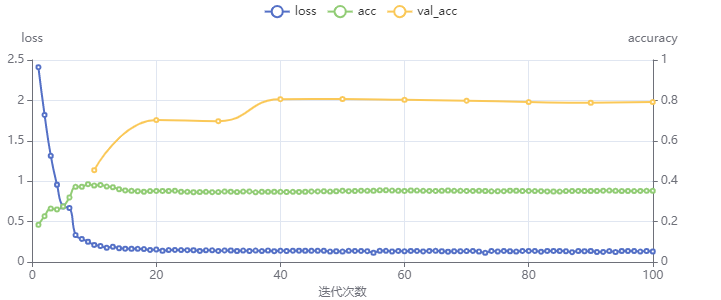

# Rapport de IOT-Projet
## 
## Analyse du marché du produit
Nous avons mis en place un compteur de véhicules qui compte le nombre de véhicules qui passent. Il peut être utilisé dans les parkings, les carrefours, les entrées des communautés, etc. pour compter les véhicules dans la zone. Il peut également être utilisé par les autorités chargées de la circulation pour compter le trafic et enregistrer les informations sur les véhicules.   
Sur le marché actuel, le comptage des véhicules est principalement réalisé à l'aide de capteurs de pression, qui sont trop à usage unique et ne peuvent être utilisés que pour le comptage des véhicules. Nous avons mis en œuvre une méthode de reconnaissance d'objets par apprentissage automatique, qui permet une mise à niveau logicielle de la surveillance pour permettre le comptage des véhicules.  
Il est également possible de conserver davantage d'informations en comptant les véhicules et en enregistrant des photos des véhicules qui passent.
## Architecture globale du systèmes
Architecture : Reconnaissance d’une voiture à l’aide d’une caméra. Une fois un véhicule reconnu, la caméra envoie l’information sur un “pc” via un protocole de communication serial. Ensuite le PC envoie la donnée sur un serveur. 
## Les risques d’atteinte au respect de la vie privée
Les conséquences possibles sont:
1. Fuite d'informations sur les véhicules
2. Enregistrement d'informations non liées aux véhicules, telles que les piétons, les rues, les événements, etc.
3. Attaques malveillantes sur la reconnaissance de l'IA (images de véhicules, etc.) conduisant à des informations erronées.
## Architecture matérielle de l’objet
Le comptoir est composé d'un kit Maixpy dans une mallette conçue par Fablab. Dans le kit, il y a une carte de développement avec une chip k210 et un écran LED. Dans les conceptions futures, il sera possible de se passer de l'affichage Led et d'envoyer les données au serveur. 
##  Le coût de la BOM de notre produit (composants, PCB et enclosure) pour 5000 unités
carte sipeed ~25€  
boitier ~1€  
somme = (25+1)*5000 = 130 000€
## Implémentation du logiciel embarqué
Nous avons pré-installé le programme principal et le modèle de reconnaissance des véhicules sur la carte de développement. Ensuite, grâce à l'algorithme yolo v2 préinstallé sur la carte de développement k210, nous avons pu identifier les véhicules en temps réel à partir des images capturées par la caméra.  
Pour nos données de formation, nous utilisons l'outil [MaixHub](https://maixhub.com/)  
Notre the base d'apprendisage  
| tags | app/val |total |
| --- | ------------- | ---- |
| car | 931/104 | 1035 |  
Et nous obtenons 80 % de correction du modèle après l'entraînement.
## Format des messages uplink et downlink échangés
Nous utilisons le port série pour nous connecter au PC, envoyer les données au PC, puis les télécharger sur le serveur.
## Métriques logiciel du logiciel embarqué
Comme la carte de développement Sipeed est développée en micropython, il suffit de télécharger le firmware, le modèle d'apprentissage et le fichier principal du programme (python) pour pouvoir graver le programme.  
firmware--2066kb  
model   --1859kb  
main.py --   4kb  
Comme la carte de développement ne dispose que de 12mb de cache, le total de tous les fichiers doit être inférieur à 12mb, notre programme est donc conforme.
## Temps d’exécution
Sur l'écran de notre terminal, nous pouvons voir l'intervalle entre chaque image, qui est généralement de 35-40ms, y compris le temps pris par la caméra plus le temps de reconnaissance de l'algorithme, ainsi que le temps d'affichage et de calcul logique.  
Pour la vidéo, nous pouvons garantir une fréquence de (1000/40)=25 images par seconde.